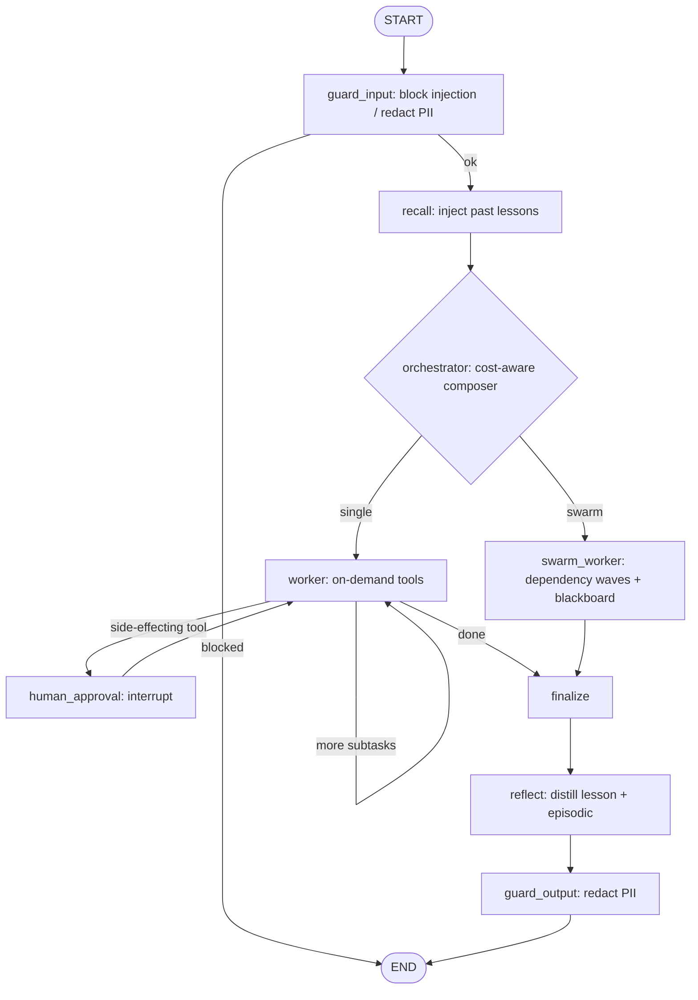

# Architecture

The framework concentrates custom engineering on the three things no framework ships off the shelf —
**self-learning memory**, a **dynamic swarm composer**, and a **versioned, MCP-compatible tool registry**
— and leans on LangGraph for durable execution, checkpointing, and HITL interrupts.

## Execution graph



Every node is **optional and additive**: with no memory/guardrails/composer configured the graph
collapses to the Stage-1 spine (`orchestrator → worker → finalize`). `recall`/`reflect` appear with
memory, `guard_input`/`guard_output` with guardrails, and `swarm_worker` when the composer chooses a
swarm.

## Layers — every one is a swappable seam

| Layer | Implementation | Later-stage seam |
|---|---|---|
| Model gateway | `LiteLLMGateway` (API-first, OpenAI-compatible) + `DemoGateway` | local vLLM endpoint |
| Agent core | thin `Agent` over the gateway | typed agent core |
| Orchestration | LangGraph orchestrator-worker graph + `SqliteSaver` | richer graphs |
| Memory | `JsonFileMemory` (persistent) + `LLMReflector`; BM25+RRF recall, distilled lessons | Letta/Mem0 + pgvector at scale |
| Swarm composer | `HeuristicSwarmComposer` — cost-aware single-vs-swarm gate + parallel execution | LLM-driven team formation |
| Tool registry | `StaticToolRegistry` — versioned, on-demand BM25 retrieval | MCP interop adapter |
| HITL | LangGraph `interrupt()` approval gate | escalation queues |
| Guardrails | `GuardrailPipeline` — block prompt-injection, redact PII (input + output) | LlamaFirewall / LLM Guard / NeMo |
| Multi-tenancy | tenant-isolated memory namespaces + per-tenant `CostTracker` dashboard | per-tenant rate limits / quotas |
| Observability | Langfuse via OTEL + own graph spans | eval/regression gates |
| Durability | LangGraph `SqliteSaver` checkpointer | Temporal for multi-day workflows |

## Repository layout

```
Riptide-Watergraph/
├── pyproject.toml               # setuptools build, src layout
└── src/riptide_watergraph/
    ├── interfaces/              # ABCs = the swappable seams (incl. Reflector)
    ├── gateway/                 # LiteLLMGateway + DemoGateway (offline)
    ├── memory/                  # JsonFileMemory, ranking, reflection, types
    ├── tools/                   # StaticToolRegistry (versioned, on-demand) + tools
    ├── swarm/                   # HeuristicSwarmComposer + cost model
    ├── guardrails/              # PII redaction, injection blocking, pipeline
    ├── mcp/                     # MCP tool interop (client, adapter, stdio)
    ├── graph/                   # state, nodes (recall/reflect/swarm/guard), builder
    ├── observability/           # OTEL + Langfuse tracing + per-tenant CostTracker
    ├── server/                  # FastAPI app + the dependency-free Studio (static/)
    ├── evaluation/              # offline task suite + scoring runner
    ├── config.py                # pydantic-settings
    └── cli.py                   # riptide run | costs | eval | serve
```

The retrieval core (**BM25** lexical scoring + **Reciprocal Rank Fusion, k=60**) lives in
`memory/ranking.py` behind a small, stable signature — if it ever shows up as a hot path it can be
swapped for a native implementation without touching the framework.
